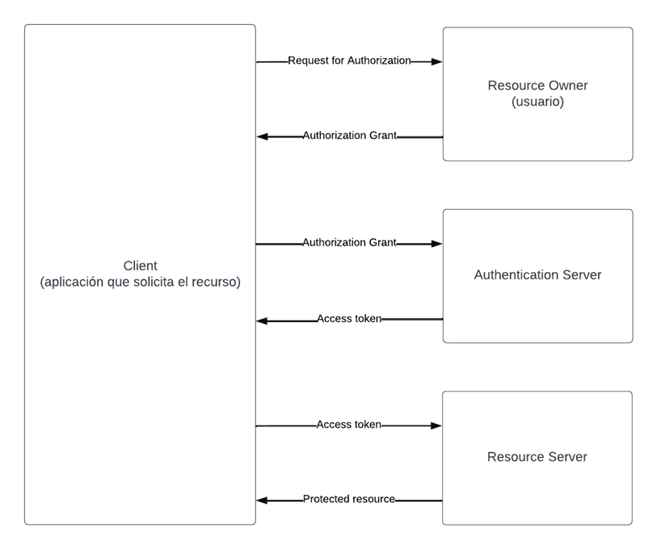

# OAUTH

## ¿Qué es OAuth? 

Open Authorization  es un estándar de autorización. 

La finalidad de OAuth es permitir a un servicio acceder a datos de un usuario almacenados en otra aplicación sin la necesidad de compartir credenciales. Su uso está ampliamente extendido como en el caso de Google, X (Twitter) , GitHub, Instagram, Amazon, Microsoft (Account, Azure Active Directory), etc. 

Un ejemplo sería cuando queremos publicar una foto en Facebook de nuestro móvil, esta última no tiene que conocer nuestras credenciales de Google para acceder a nuestras fotos. Hemos dado permiso a Facebook para que acceda a este recurso y así poder publicar nuestras fotos sin darle acceso a nuestro correo u otra información. 

OAuth comenzó a gestarse en noviembre de 2006, publicando un primer borrador en octubre de 2007 y su primera versión en abril de 2010. 

La versión actual OAuth 2.0, más simple y flexible, no es compatible con OAuth 1.0 que ha sido reemplazada en casi su totalidad por la nueva versión. Los nuevos desarrollos e implementaciones se basan en OAuth2. 

### OAuth define cuatro roles:

- Resource Owner: El usuario propietario de los datos. 

- Resource Server: El servicio que almacena los datos del usuario. Requiere un token para acceder a estos datos. 

- Client: El servicio o aplicación que quiere acceder a uno o varios datos del usuario. 

- Authorization Server: La aplicación donde el usuario se autentica y proporciona el consentimiento al cliente para acceder a sus datos. Esta aplicación también proporciona tokens al cliente para el acceso a los datos a los que ha sido autorizado. 

### Tipos de cliente OAuth2: 

- Confidential client: puede almacenar claves secretas de forma segura. 

- Public client: los que no pueden. 
 
### Tipos de autorización (Grant types) más comunes: 

Authorization Code 

PKCE (leído como pixie) 

Client Credentials 

Device Code 

Refresh Token  

### Flujo abstracto de protocolo: 

 
#### Páginas de referencia
- https://oauth.net/2/
- https://fusionauth.io/articles/oauth/modern-guide-to-oauth
- https://www.spainclouds.com/blog/ejemplo-de-authorization-code-flow-de-oauth-2-0
- https://www.youtube.com/watch?v=66Z6nFzLTos
 